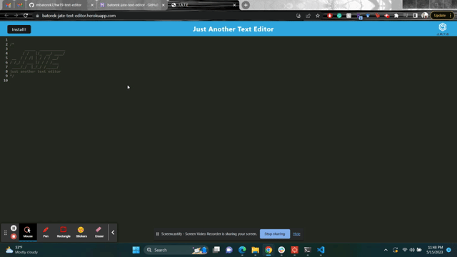

# Text Editor

## User Story
```md
AS A developer
I WANT to create notes or code snippets with or without an internet connection
SO THAT I can reliably retrieve them for later use
```
## Acceptance Criteria
```md
GIVEN a text editor web application
WHEN I open my application in my editor
THEN I should see a client server folder structure
WHEN I run `npm run start` from the root directory
THEN I find that my application should start up the backend and serve the client
WHEN I run the text editor application from my terminal
THEN I find that my JavaScript files have been bundled using webpack
WHEN I run my webpack plugins
THEN I find that I have a generated HTML file, service worker, and a manifest file
WHEN I use next-gen JavaScript in my application
THEN I find that the text editor still functions in the browser without errors
WHEN I open the text editor
THEN I find that IndexedDB has immediately created a database storage
WHEN I enter content and subsequently click off of the DOM window
THEN I find that the content in the text editor has been saved with IndexedDB
WHEN I reopen the text editor after closing it
THEN I find that the content in the text editor has been retrieved from our IndexedDB
WHEN I click on the Install button
THEN I download my web application as an icon on my desktop
WHEN I load my web application
THEN I should have a registered service worker using workbox
WHEN I register a service worker
THEN I should have my static assets pre cached upon loading along with subsequent pages and static assets
WHEN I deploy to Heroku
THEN I should have proper build scripts for a webpack application
```

## Description
With this application, the user is able to take any notes whether they have an internet connection or not. If the user takes notes without a connection, the data will be saved and uploaded the next time a connection is established.

<p align="center">
    <a href="https://batorek-jate-text-editor.herokuapp.com/"></a>
</p>

## Screenshots

Here is what the final product looks like and how to use it:




## Installation
To clone this repo:

git clone git@github.com:mbatorek7/hw19-text-editor.git

## License
[](https://opensource.org/licenses/MIT)

  ## Questions?
  - Github Profile: [https://github.com/mbatorek7](https://github.com/mbatorek7)
  - Email: [maegan.batorek@valpo.edu](maegan.batorek@valpo.edu)